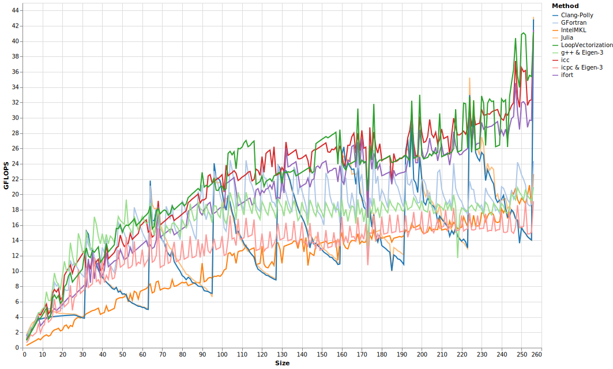
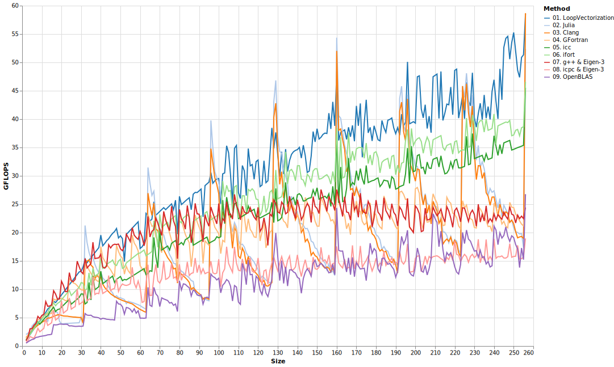

# Dot Products

Dot products are so simple, it is almost surprising that compilers leave any performance on the table.

```julia
function jdotavx(a, b)
    s = zero(eltype(a))
    @avx for i ∈ eachindex(a, b)
        s += a[i] * b[i]
    end
    s
end
```



```julia
function jselfdotavx(a)
    s = zero(eltype(a))
    @avx for i ∈ eachindex(a)
        s += a[i] * a[i]
    end
    s
end
```


