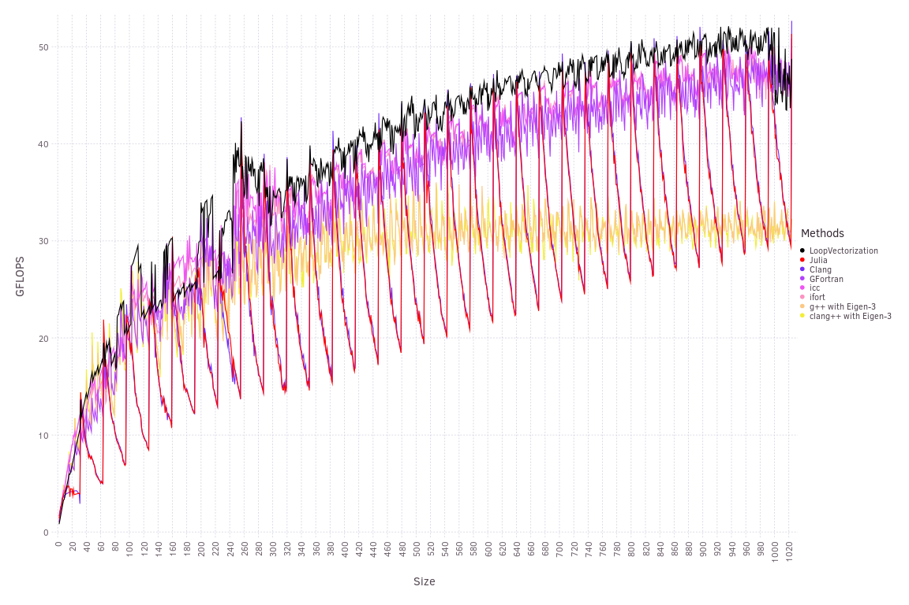
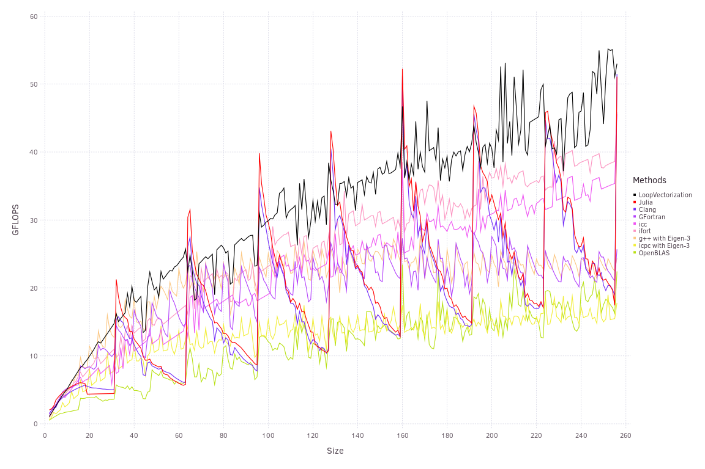

# Dot Products

[Dot products](https://en.wikipedia.org/wiki/Dot_product) are simple the sum of the elementwise products of two vectors. They can be interpreted geometrically as (after normalizing by dividing by the norms of both vectors) yielding the cosine of the angle between them. This makes them useful for, for example, the [No-U-Turn](http://www.stat.columbia.edu/~gelman/research/published/nuts.pdf) sampler to check for u-turns (i.e., to check if the current momentum is no longer in the same direction as the change in position).

```julia
function jdotavx(a, b)
    s = zero(eltype(a))
    @avx for i ∈ eachindex(a, b)
        s += a[i] * b[i]
    end
    s
end
```
To execute the loop using SIMD (Single Instruction Multiple Data) instructions, you have to unroll the loop. Rather than evaluating the loop as written -- adding element-wise products to a single accumulator one after the other -- you can multiply short vectors loaded from `a` and `b` and add their results to a vector of accumulators. 

Most modern CPUs found in laptops or desktops have the AVX instruction set, which allows them to operate on 256 bit vectors -- meaning the vectors can hold 4 double precision (64 bit) floats. Some have the AVX512 instruction set, which increases the vector size to 512 bits, and also adds many new instructions that make vectorizing easier. To be gemeral across CPUs and data types, I'll refer to the number of elements in the vectors with `W`. I'll also refer to unrolling a loop by a factor of `W` and loading vectors from it as "vectorizing" that loop.

In addition to vectorizing the loop, we'll want to unroll it by an additional factor. Given that we have single or double precision floating point elements, most recent CPU cores have a potential throughput of two fused multiply-add (`fma`) instructions per clock cycle. However, it actually takes about four clock cycles for any of these instructions to execute; a single core is able to work on several in parallel.

This means that if we used a single vector to accumulate a product, we'd only get to perform one fused multiply add every four clock cycles: we'd have to wait for one instruction to complete before starting the next. By using extra accumulation vectors, we can break up this dependency chain.
If we had 8 accumulators, then theoretically we could perform two per clock cycle, and after the 4th cycle, our first operations are done so that we can reuse them.

However, there is another bottle neck: we can only perform 2 aligned loads per clock cycle (or 1 unaligned load). [Alignment here means with respect to a memory address boundary, if your vectors are 256 bits, then a load/store is aligned if it is with respect to a memory address that is an integer multiple of 32 bytes (256 bits = 32 bytes).]
Thus, in 4 clock cycles, we can do up to 8 loads. But each `fma` requires 2 loads, meaning we are limited to 4 of them per 4 clock cyles, and any unrolling beyond 4 gives us no benefit.

Double precision benchmarks pitting Julia's builtin dot product (named `MKL` here), and code compiled with a variety of compilers:

What we just described is the core of the approach used by all these compilers. The variation in results is explained mostly by how they handle vectors with lengths that are not an integer multiple of `W`. I ran these on a computer with AVX512 so that `W = 8`. LLVM, the backend compiler of both Julia and Clang, shows rapid performance degredation as `N % 4W` increases, where `N` is the length of the vectors.
This is because, to handle the remainder, it uses a scalar loop that runs as written: multiply and add single elements, one after the other. 

Initially, GCC (gfortran) stumbled in throughput, because it does not use separate accumulation vectors by default except on Power, even with `-funroll-loops`.
I compiled with the flags `-fvariable-expansion-in-unroller --param max-variable-expansions-in-unroller=4` to allow for 4 accumulation vectors, yielding good performance.

The Intel compilers have a secondary vectorized loop without any additional unrolling that masks off excess lanes beyond `N` (for when `N` isn't an integer multiple of `W`).
LoopVectorization uses `if/ifelse` checks to determine how many extra vectors are needed, the last of which is masked.

Neither GCC nor LLVM use masks (without LoopVectorization's assitance).

I am not certain, but I believe Intel and GCC check for the vector's alignment, and align them if neccessary. Julia guarantees that the start of arrays beyond a certain size are aligned, so this is not an optimization I have implemented. But it may be worthwhile for handling large matrices with a number of rows that isn't an integer multiple of `W`. For such matrices, the first column may be aligned, but the next will not be.

## Dot-Self

A related problem is taking the dot product of a vector with itself; taking the sum of squares is a common operation, for example when calculating the (log)density of independent normal variates:
```julia
function jselfdotavx(a)
    s = zero(eltype(a))
    @avx for i ∈ eachindex(a)
        s += a[i] * a[i]
    end
    s
end
```
Because we only need a single load per `fma`-instruction, we can now benefit from having 8 separate accumulators.
For this reason, LoopVectorization now unrolls by 8 -- it decides how much to unroll by comparing the bottlenecks on throughput with latency. The other compilers do not change their behavior, so now LoopVectorization has the advantage:

This algorithm may need refinement, because Julia (without LoopVectorization) only unrolls by 4, yet achieves roughly the same performance as LoopVectorization at multiples of `4W = 32`, although performance declines rapidly from there due to the slow scalar loop. Performance for most is much higher -- more GFLOPS -- than the normal dot product, but still under half of the CPU's potential 131.2 GFLOPS, suggesting that some other bottlenecks are preventing the core from attaining 2 fmas per clock cycle.
Note also that `8W = 64`, so we don't really have enough iterations of the loop to amortize the overhead of performing the reductions of all these vectors into a single scalar.
By the time the vectors are long enough to do this, we'll start running into memory bandwidth bottlenecks.


