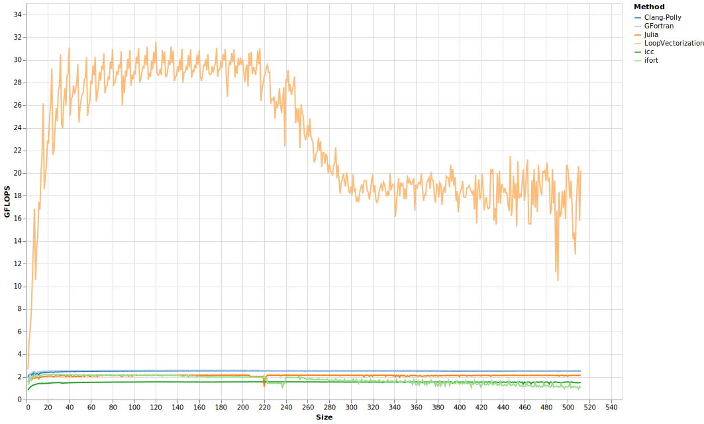
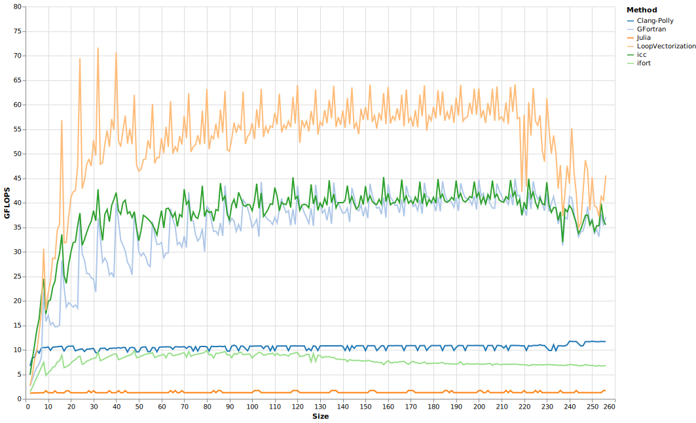
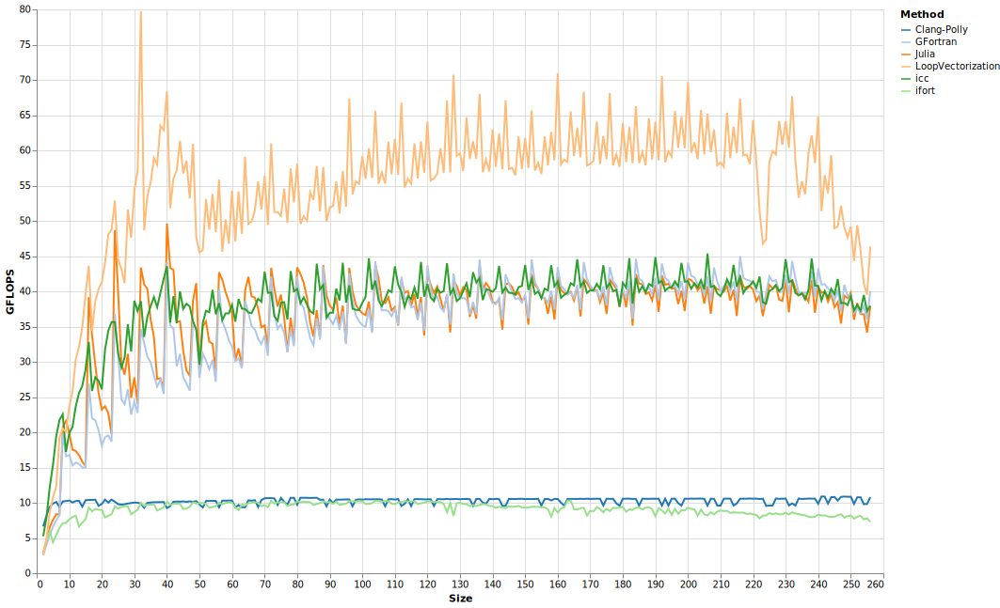

# Image Filtering

Here, we convolve a small matrix `kern` with a larger matrix `A`, storing the results in `out`:
```julia
function filter2davx!(out::AbstractMatrix, A::AbstractMatrix, kern)
    rng1k, rng2k = axes(kern)
    rng1,  rng2  = axes(out)
    @avx for j in rng2, i in rng1
        tmp = zero(eltype(out))
        for jk in rng2k, ik in rng1k
            tmp += A[i+ik,j+jk]*kern[ik,jk]
        end
        out[i,j] = tmp
    end
    out
end
```
These are four nested loops. For all the benchmarks, `kern` was only 3 by 3, making it too small for vectorizing these loops to be particularly profitable. By vectorizing the `i` loop instead, it can benefit from SIMD and also avoid having to do a reduction (horizontal addition) of a vector before storing in `out`, as the vectors can then be stored directly.


LoopVectorization achieved much better performance than all the alternatives, which tended to prefer vectorizing the inner loops.
By making the compilers aware that the `ik` loop is too short to be worth vectorizing, we can get them to vectorize something else instead. By defining the size of `kern` as constant in `C` and `Fortran`, and using size parameters in Julia, we can inform the compilers:

Now all are doing much better than they were before, although still well shy of the 131.2 GFLOPS theoretical limit for the host CPU cores. While they all improved, two are lagging behind the main group:
- `ifort` lags behind all the others except base Julia. I'd need to do more investigating to find out why.
- Providing static size information was enough for all to realize vectorizing the inner loops was not worth it. However, all but base Julia decided to vectorize a different loop instead, while the base Julia version I tested just didn't vectorize at all. 

Helping Base Julia out by manually unrolling the inner loops:

This manual unrolling helped Julia, but had no real impact on any of the others.

