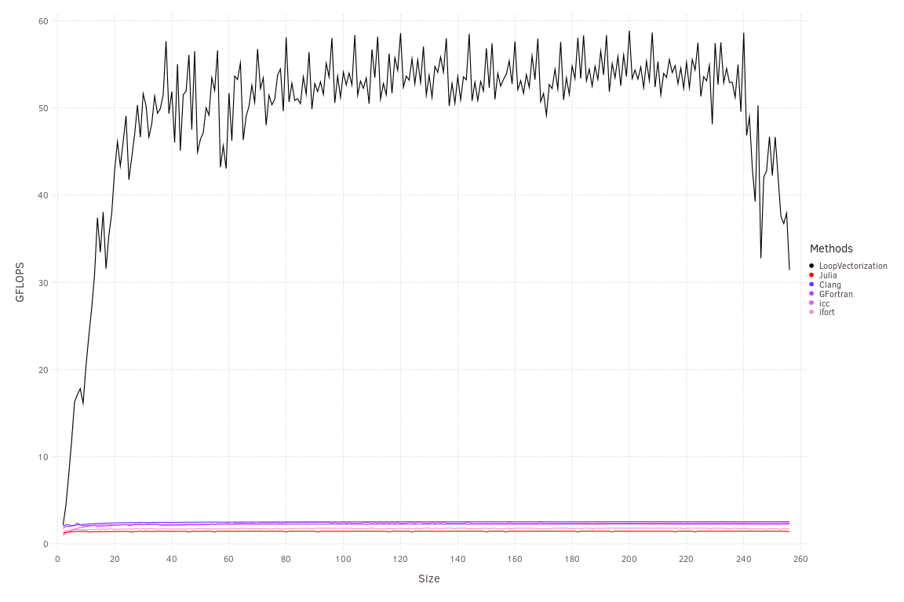
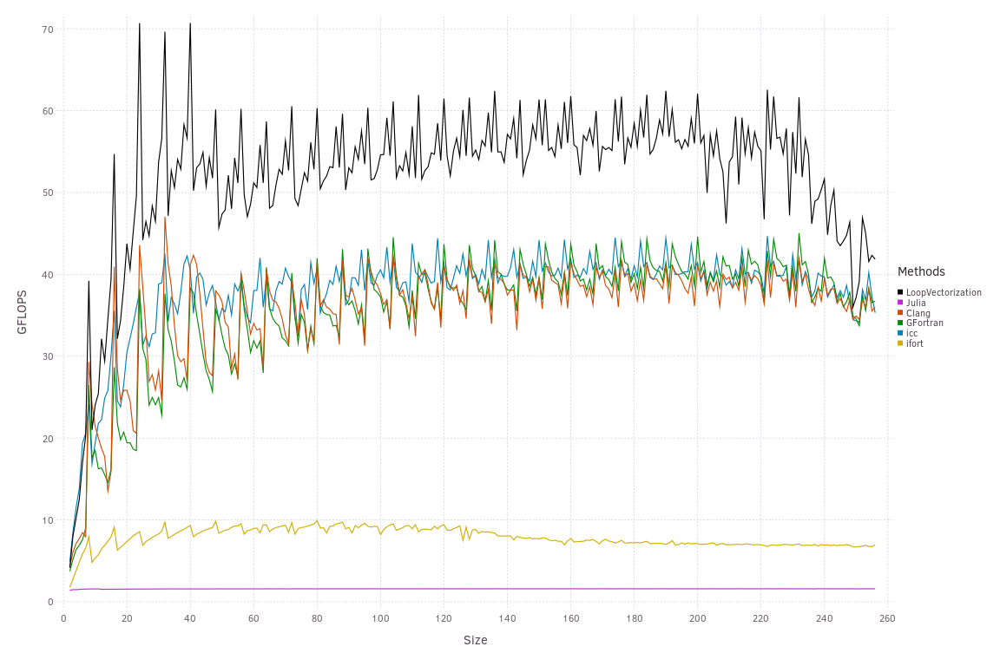
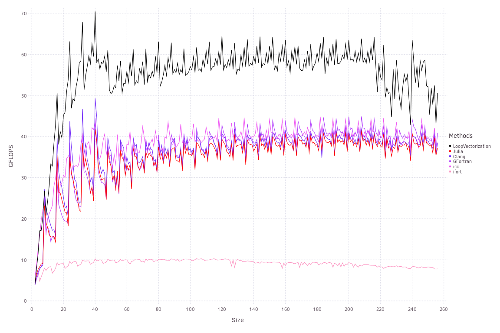

# Image Filtering

Here, we convolve a small matrix `kern` with a larger matrix `A`, storing the results in `out`, using Julia's generic [Cartesian Indexing](https://julialang.org/blog/2016/02/iteration/):
```julia
using LoopVectorization, OffsetArrays, Images
kern = Images.Kernel.gaussian((1, 1), (3, 3))
function filter2davx!(out::AbstractMatrix, A::AbstractMatrix, kern)
    @avx for J in CartesianIndices(out)
        tmp = zero(eltype(out))
        for I ∈ CartesianIndices(kern)
            tmp += A[I + J] * kern[I]
        end
        out[J] = tmp
    end
    out
end
```
These are effectively four nested loops. For all the benchmarks, `kern` was 3 by 3, making it too small for vectorizing these loops to be particularly profitable. By vectorizing an outer loop instead, it can benefit from SIMD and also avoid having to do a reduction (horizontal addition) of a vector before storing in `out`, as the vectors can then be stored directly.


LoopVectorization achieved much better performance than all the alternatives, which tried vectorizing the inner loops.
By making the compilers aware that the inner loops are too short to be worth vectorizing, we can get them to vectorize an outer loop instead. By defining the size of `kern` as constant in `C` and `Fortran`, and using size parameters in Julia, we can inform the compilers:

Now all are doing much better than they were before, although still well shy of the 131.2 GFLOPS theoretical limit for the host CPU cores. While they all improved, two are lagging behind the main group:
- `ifort` lags behind all the others except base Julia. I'll need to do more investigating to find out why.
- Base Julia. While providing static size information was enough for it to realize vectorizing the inner loops was not worth it, base Julia was seemingly the only one that didn't decide to vectorize an outer loop instead.

Manually unrolling the inner loops allows base Julia to vectorize, while the performance of all non-Julia variants was unchanged:

LoopVectorization is currently limited to only unrolling two loops (but a third may be vectorized, effectively unrolling it by the length of the vectors). Manually unrolling two of the loops lets up to four loops be unrolled.

