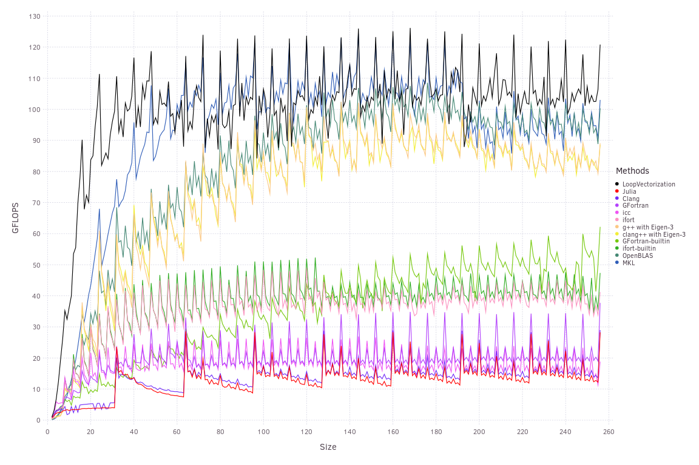
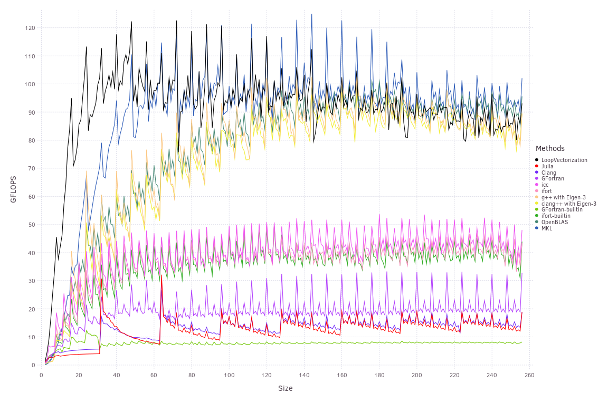
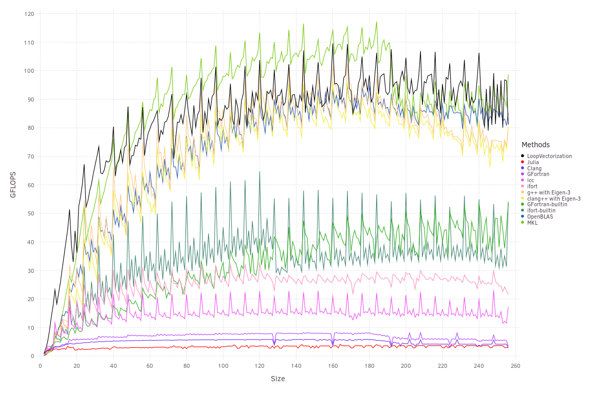

# Matrix Multiplication

One of the friendliest problems for vectorization is matrix multiplication. Given `M × K` matrix `𝐀`, and `K × N` matrix `𝐁`, multiplying them is like performing `M * N` dot products of length `K`. We need `M*K + K*N + M*N` total memory, but `M*K*N` multiplications and additions, so there's a lot more arithmetic we can do relative to the memory needed.

LoopVectorization currently doesn't do any memory-modeling or memory-based optimizations, so it will still run into problems as the size of matrices increases. But at smaller sizes, it's capable of achieving a healthy percent of potential GFLOPS.
We can write a single function:
```julia
function A_mul_B!(𝐂, 𝐀, 𝐁)
    @avx for m ∈ axes(𝐀,1), n ∈ axes(𝐁,2)
        𝐂mn = zero(eltype(𝐂))
        for k ∈ axes(𝐀,2)
            𝐂mn += 𝐀[m,k] * 𝐁[k,n]
        end
        𝐂[m,n] = 𝐂mn
    end
end
```
and this can handle all transposed/not-tranposed permutations. LoopVectorization will change loop orders and strategy as appropriate based on the types of the input matrices. For each of the others, I wrote separate functions to handle each case. 
Letting all three matrices be square and `Size` x `Size`, we attain the following benchmark results:


This is classic GEMM, `𝐂 = 𝐀 * 𝐁`. GFortran's intrinsic `matmul` function does fairly well. But all the compilers are well behind LoopVectorization here, which falls behind MKL's `gemm` beyond 70x70 or so. The problem imposed by alignment is also striking: performance is much higher when the sizes are integer multiplies of 8. Padding arrays so that each column is aligned regardless of the number of rows can thus be very profitable. [PaddedMatrices.jl](https://github.com/chriselrod/PaddedMatrices.jl) offers just such arrays in Julia. I believe that is also what the [-pad](https://software.intel.com/en-us/fortran-compiler-developer-guide-and-reference-pad-qpad) compiler flag does when using Intel's compilers.


The optimal pattern for `𝐂 = 𝐀 * 𝐁ᵀ` is almost identical to that for `𝐂 = 𝐀 * 𝐁`. Yet, gfortran's `matmul` instrinsic stumbles, surprisingly doing much worse than gfortran + loops, and almost certainly worse than allocating memory for `𝐁ᵀ` and creating the ecplicit copy.

ifort did equally well whethor or not `𝐁` was transposed, while LoopVectorization's performance degraded slightly faster as a function of size in the transposed case, because strides between memory accesses are larger when `𝐁` is transposed. But it still performed best of all the compiled loops over this size range, losing out to MKL and eventually OpenBLAS.
icc interestingly does better when it is transposed.

GEMM is easiest when the matrix `𝐀` is not tranposed (assuming column-major memory layouts), because then you can sum up columns of `𝐀` to store into `𝐂`. If `𝐀` were transposed, then we cannot efficiently load contiguous elements from `𝐀` that can best stored directly in `𝐂`. So for `𝐂 = 𝐀ᵀ * 𝐁`, contiguous vectors along the `k`-loop have to be reduced, adding some overhead.

Packing is critical for performance here. LoopVectorization does not pack, therefore it is well behind MKL and OpenBLAS, which do. Eigen packs, but is poorly optimized for this CPU architecture.

When both `𝐀` and ` 𝐁` are transposed, we now have `𝐂 = 𝐀ᵀ * 𝐁ᵀ = (𝐁 * 𝐀)ᵀ`.

Julia, Clang, and gfortran all struggled to vectorize this, because none of the matrices share a contiguous access: `M` for `𝐂`, `K` for `𝐀ᵀ`, and `N` for `𝐁ᵀ`. However, LoopVectorization and all the specialized matrix multiplication functions managed to do about as well as normal; transposing while storing the results takes negligible amounts of time relative to the matrix multiplication itself.
The ifort-loop version also did fairly well.


