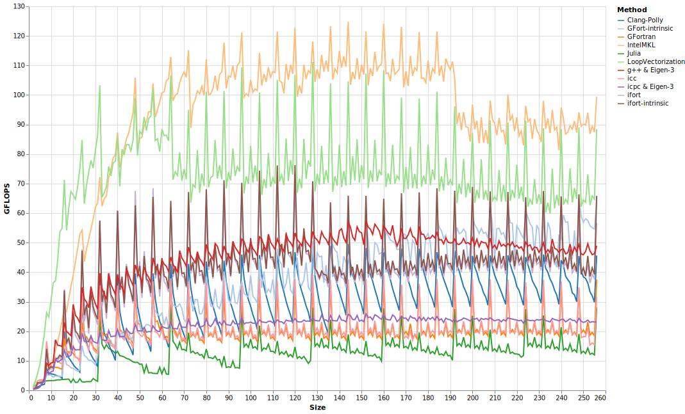
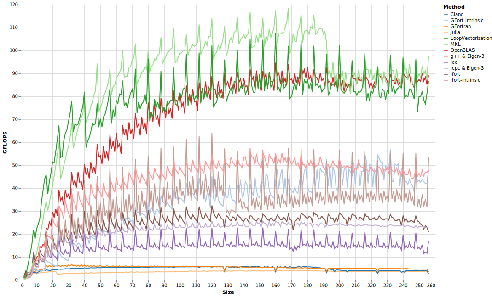

# Matrix Multiplication

One of the friendliest problems for vectorization is matrix multiplication. Given `M × K` matrix `𝐀`, and `K × N` matrix `𝐁`, multiplying them is like performing `M * N` dot products of length `K`. We need `M*K + K*N + M*N` total memory, but `M*K*N` multiplications and additions, so there's a lot more arithmetic we can do relative to the memory needed.

LoopVectorization currently doesn't do any memory-modeling or memory-based optimizations, so it will still run into problems as the size of matrices increases. But at smaller sizes, it's capable of achieving a healthy percent of potential GFLOPS.
We can write a single function:
```julia
@inline function A_mul_B!(𝐂, 𝐀, 𝐁)
    @avx for m ∈ 1:size(𝐀,1), n ∈ 1:size(𝐁,2)
        𝐂ₘₙ = zero(eltype(𝐂))
        for k ∈ 1:size(𝐀,2)
            𝐂ₘₙ += 𝐀[m,k] * 𝐁[k,n]
        end
        𝐂[m,n] = 𝐂ₘₙ
    end
end
```
and this can handle all transposed/not-tranposed permutations. LoopVectorization will change loop orders and strategy as appropriate based on the types of the input matrices. For each of the others, I wrote separate functions to handle each case. 
Letting all three matrices be square and `Size` x `Size`, we attain the following benchmark results:


This is classic GEMM, `𝐂 = 𝐀 * 𝐁`. GFortran's intrinsic `matmul` function does fairly well, as does Clang-Polly, because Polly is designed to specfically recognize GEMM-like loops and optimize them. But all the compilers are well behind LoopVectorization here, which falls behind MKL's `gemm` beyond `56 × 56`. The problem imposed by alignment is also striking: performance is much higher when the sizes are integer multiplies of 8. Padding arrays so that each column is aligned regardless of the number of rows can thus be very profitable. [PaddedMatrices.jl](https://github.com/chriselrod/PaddedMatrices.jl) offers just such arrays in Julia. I believe that is also what the [-pad](https://software.intel.com/en-us/fortran-compiler-developer-guide-and-reference-pad-qpad) compiler flag does when using Intel's compilers.


The optimal pattern for `𝐂 = 𝐀 * 𝐁ᵀ` is almost identical to that for `𝐂 = 𝐀 * 𝐁`. Yet, as soon as we deviate slightly from the gemm-loops, Clang-Polly's pattern matching doesn't identify the loops, and it fails to optimize at all. LoopVectorization and the three Intel-compiled versions all do well. Similarly, it seems that gfortran's `matmul` instrinsic function has only been optimized for the non-transposed case, so that the simple loops actually performed better here.

ifort did equally well whethor or not `𝐁` was transposed, while LoopVectorization's performance degraded slightly faster as a function of size in the transposed case, because strides between memory accesses are larger when `𝐁` is transposed. But it still performed best of all the compiled loops over this size range, only losing to MKL.
icc interestingly does better when it is transposed.

GEMM is easiest when the matrix `𝐀` is not tranposed (assuming column-major memory layouts), because then you can sum up columns of `𝐀` to store into `𝐂`. If `𝐀` were transposed, then we cannot efficiently load contiguous elements from `𝐀` that can best stored directly in `𝐂`. So for `𝐂 = 𝐀ᵀ * 𝐁`, contiguous vectors along the `k`-loop have to be reduced, adding some overhead.

I am not sure what exactly MKL is doing, but it is able to maintain its performance. I suspect it may be able to efficiently transpose and pack the arrays.

LoopVectorization and both ifort versions have similar performance, while icc isn't too far behind. Clang-Polly is far in last.

When both `𝐀` and ` 𝐁` are transposed, the loops become rather awkward to vectorize.


LoopVectorization and MKL managed to do about as well as normal.
The ifort and gfortran intrinsics also do fairly well here, perhaps because it can be expressed as:
```fortran
C = transpose(matmul(B, A))
```
The ifort-loop version also did fairly well. The other loop versions did poorly.


