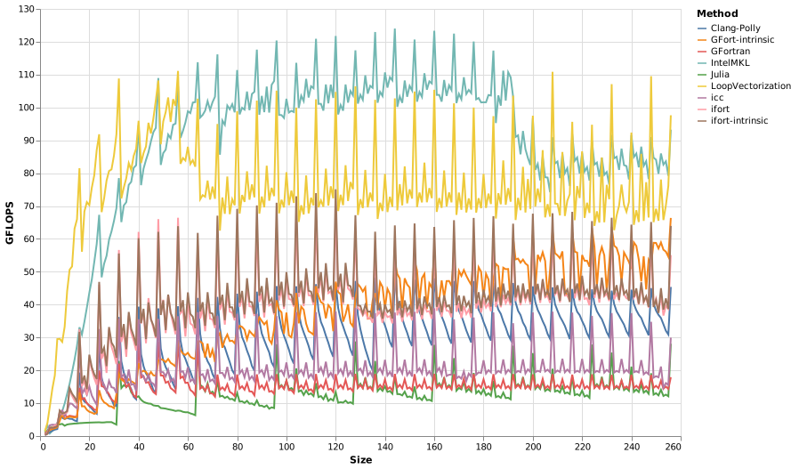
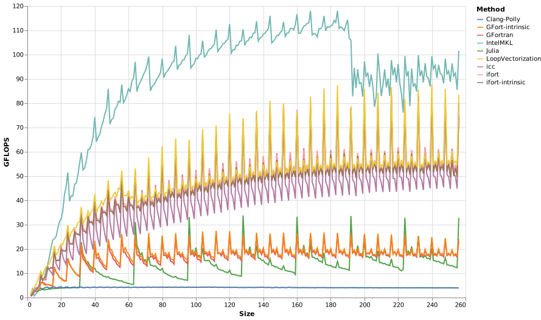

# Matrix Multiplication

```julia
@inline function A_mul_B!(𝐂, 𝐀, 𝐁)
    @avx for m ∈ 1:size(𝐀,1), n ∈ 1:size(𝐁,2)
        𝐂ₘₙ = zero(eltype(𝐂))
        for k ∈ 1:size(𝐀,2)
            𝐂ₘₙ += 𝐀[m,k] * 𝐁[k,n]
        end
        𝐂[m,n] = 𝐂ₘₙ
    end
end
```

Letting all three matrices be square and `Size` x `Size`, we attain the following benchmark results:







