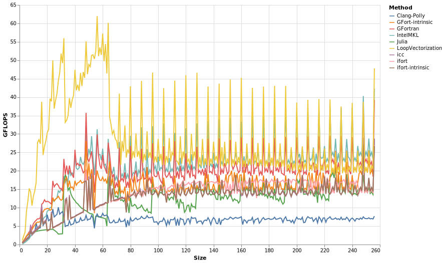
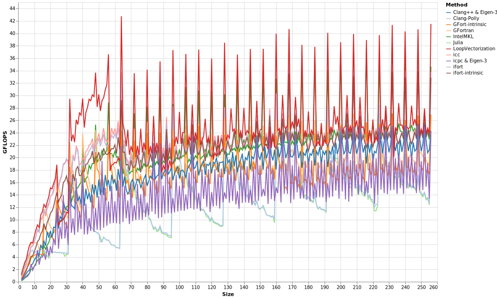
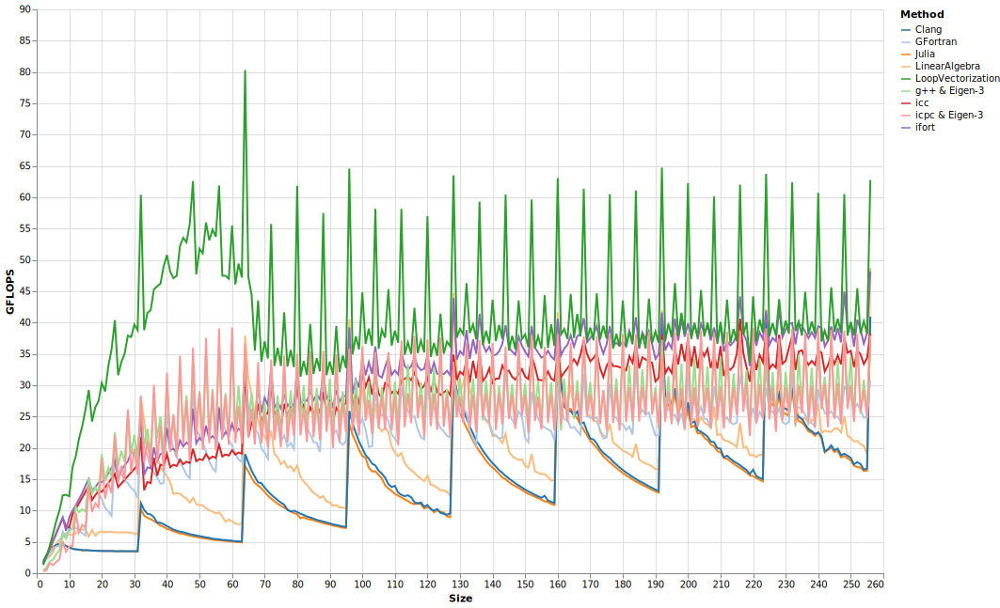

# Matrix-Vector Operations

Here I'll discuss a variety of Matrix-vector operations, naturally starting with matrix-vector multiplication.

```julia
@inline function jgemvavx!(𝐲, 𝐀, 𝐱)
    @avx for i ∈ eachindex(𝐲)
        𝐲ᵢ = zero(eltype(𝐲))
        for j ∈ eachindex(𝐱)
            𝐲ᵢ += 𝐀[i,j] * 𝐱[j]
        end
        𝐲[i] = 𝐲ᵢ
    end
end
```

Using a square `Size` x `Size` matrix `A`, we find the following results.









