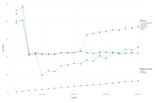
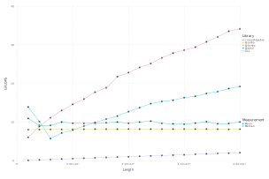
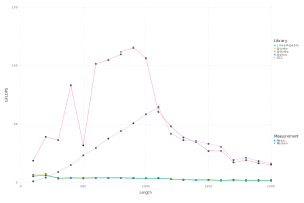

# Multithreading

LoopVectorization can multithread loops if you pass the argument `@turbo thread=true for ... end` or equivalently use `@tturbo`. By default, `thread = false`, which runs only a single thread.
You can also supply a numerical argument to set an upper bound on the number of threads, e.g. `@turbo thread=8 for ... end` will use up to `min(8,Threads.nthreads(),VectorizationBase.num_cores())` threads. `VectorizationBase.num_cores()` uses [Hwloc.jl](https://github.com/JuliaParallel/Hwloc.jl) to get the number of physical cores.
Currently, this only works for `for` loops, but support for broadcasting will come.

Lets look at a few benchmarks.

Taking the [first example from the ThreadsX.jl README](https://github.com/tkf/ThreadsX.jl/blob/3ff8264f1c4b92318e836a1994a38ffde0433553/README.md):
```julia
function relative_prime_count(x, N)
    c = 0
    @tturbo for i ∈ 1:N
        c += gcd(x, i) == 1
    end
    c
end
```
Benchmarking them:
```julia
julia> @btime ThreadsX.sum(gcd(42, i) == 1 for i in 1:10_000)
  130.928 μs (3097 allocations: 240.39 KiB)
2857

julia> @btime relative_prime_count(42, 10_000)
  3.376 μs (0 allocations: 0 bytes)
2857
```
Note that much of the performance difference here is thanks to SIMD, which requires AVX512 for good performance (`trailing_zeros`, required by `gcd`, needs AVX512 for a SIMD version).
LoopVectorization is a good choice for loops (a) amenable to SIMD (b) where all arrays are dense and (c) a static schedule would work well. Generally, this means loops built up of
relatively primitive arithmetic operations (e.g. `+`, `/`, or `log`), and not, for example, solving differential equations.

I'll make comparisons with OpenMP through the rest of this, starting with a simple dot product to focus on threading overhead:
```julia
function dotavxt(a::AbstractArray{T}, b::AbstractArray{T}) where {T <: Real}
    s = zero(T)
    @tturbo for i ∈ eachindex(a,b)
        s += a[i] * b[i]
    end
    s
end
function dotbaseline(a::AbstractArray{T}, b::AbstractArray{T}) where {T}
    s = zero(T)
    @fastmath @inbounds @simd for i ∈ eachindex(a,b)
        s += a[i]' * b[i]
    end
    s
end
```
In `C`:
```C
#include<omp.h>
//  gcc -Ofast -march=native -mprefer-vector-width=512 -fopenmp -shared -fPIC openmp.c -o libomptest.so
double dot(double* a, double* b, long N){
  double s = 0.0;
  #pragma omp parallel for reduction(+: s)
  for(long n = 0; n < N; n++){
    s += a[n]*b[n];
  }
  return s;
}
```
Wrapping it in Julia is straightforward, after compiling:
```julia
using Libdl; const OPENMPTEST = joinpath(pkgdir(LoopVectorization), "benchmark", "libomptest.$(Libdl.dlext)");
cdot(a::AbstractVector{Float64},b::AbstractVector{Float64}) = @ccall OPENMPTEST.dot(a::Ref{Float64}, b::Ref{Float64}, length(a)::Clong)::Float64
```

Trying out one size to give a perspective on scale:
```julia
julia> N = 10_000; x = rand(N); y = rand(N);

julia> @btime dot($x, $y)
  1.114 μs (0 allocations: 0 bytes)
2480.296446711209

julia> @btime dotavx($x, $y)
  761.621 ns (0 allocations: 0 bytes)
2480.296446711209

julia> @btime dotavxt($x, $y)
  622.723 ns (0 allocations: 0 bytes)
2480.296446711209

julia> @btime dotbaseline($x, $y)
  1.294 μs (0 allocations: 0 bytes)
2480.2964467112097

julia> @btime cdot($x, $y)
  6.109 μs (0 allocations: 0 bytes)
2480.2964467112092
```
All these times are fairly fast; `wait(Threads.@spawn 1+1)` will typically take much longer than even `@cdot` did here.



Now let's look at a more complex example:
```julia
function dotavxt(ca::AbstractVector{Complex{T}}, cb::AbstractVector{Complex{T}}) where {T}
    a = reinterpret(reshape, T, ca)
    b = reinterpret(reshape, T, cb)
    re = zero(T); im = zero(T)
    @turbo for i ∈ axes(a,2) # adjoint(a[i]) * b[i]
        re += a[1,i] * b[1,i] + a[2,i] * b[2,i]
        im += a[1,i] * b[2,i] - a[2,i] * b[1,i]
    end
    Complex(re, im)
end
```
LoopVectorization currently only supports arrays of type `T <: Union{Bool,Base.HWReal}`. So to support `Complex{T}`, we reinterpret the arrays and then write out the corresponding operations.
The plan is to eventually have LoopVectorization do this automatically, but for now we require this workaround.
Corresponding `C`:
```C
void cdot(double* c, double* a, double* b, long N){
  double r = 0.0, i = 0.0;
  #pragma omp parallel for reduction(+: r, i)
  for(long n = 0; n < N; n++){
    r += a[2*n] * b[2*n  ] + a[2*n+1] * b[2*n+1];
    i += a[2*n] * b[2*n+1] - a[2*n+1] * b[2*n  ];
  }
  c[0] = r;
  c[1] = i;
  return;
}
```
The Julia wrapper:
```julia
function cdot(x::AbstractVector{Complex{Float64}}, y::AbstractVector{Complex{Float64}})
    c = Ref{Complex{Float64}}()
    @ccall OPENMPTEST.cdot(c::Ref{Complex{Float64}}, x::Ref{Complex{Float64}}, y::Ref{Complex{Float64}}, length(x)::Clong)::Cvoid
    c[]
end
```

The complex dot product is more compute bound. Given the same number of elements, we require `2x` the memory for complex numbers, `4x` the floating point arithmetic,
and as we have an array of structs rather than structs of arrays, we need additional instructions to shuffle the data.



If we take this further to the three-argument dot product, which isn't implemented in BLAS, `@tturbo` now holds a substantial advantage over the competition:
```julia
function dotavxt(ca::AbstractVector{Complex{T}}, cb::AbstractVector{Complex{T}}) where {T}
    a = reinterpret(reshape, T, ca)
    b = reinterpret(reshape, T, cb)
    re = zero(T); im = zero(T)
    @tturbo for i ∈ axes(a,2) # adjoint(a[i]) * b[i]
        re += a[1,i] * b[1,i] + a[2,i] * b[2,i]
        im += a[1,i] * b[2,i] - a[2,i] * b[1,i]
    end
    Complex(re, im)
end
```

```C
void cdot3(double* c, double* x, double* A, double* y, long M, long N){
  double sr = 0.0, si = 0.0;
#pragma omp parallel for reduction(+: sr, si)
  for (long n = 0; n < N; n++){
    double tr = 0.0, ti = 0.0;
    for(long m = 0; m < M; m++){
      tr += x[2*m] * A[2*m   + 2*n*N] + x[2*m+1] * A[2*m+1 + 2*n*N];
      ti += x[2*m] * A[2*m+1 + 2*n*N] - x[2*m+1] * A[2*m   + 2*n*N];
    }
    sr += tr * y[2*n  ] - ti * y[2*n+1];
    si += tr * y[2*n+1] + ti * y[2*n  ];
  }
  c[0] = sr;
  c[1] = si;
  return;
}
```
The wrapper is more or less the same as before:
```julia
function cdot(x::AbstractVector{Complex{Float64}}, A::AbstractMatrix{Complex{Float64}}, y::AbstractVector{Complex{Float64}})
    c = Ref{Complex{Float64}}()
    M, N = size(A)
    @ccall OPENMPTEST.cdot3(c::Ref{Complex{Float64}}, x::Ref{Complex{Float64}}, A::Ref{Complex{Float64}}, y::Ref{Complex{Float64}}, M::Clong, N::Clong)::Cvoid
    c[]
end
```


When testing on my laptop, the `C` implentation ultimately won, but I will need to investigate further to tell whether this benchmark benefits from hyperthreading,
or if it's because LoopVectorization's memory access patterns are less friendly.
I plan to work on cache-level blocking to increase memory friendliness eventually, and will likely also allow it to take advantage of hyperthreading/simultaneous multithreading, although I'd prefer a few motivating test problems to look at first. Note that a single core of this CPU is capable of exceeding 100 GFLOPS of double precision compute. The execution units are spending most of their time idle. So the question of whether hypthreading helps may be one of whether or not we are memory-limited.

For a more compute-limited operation, lets look at matrix multiplication, which requires `O(N³)` compute for `O(N²)` memory. Note that it's still easy to be memory-starved in matrix multiplication, especially for larger matrices. While the total memory required may be `O(N²)`, if the memory doesn't fit in the high cache levels, it will have to churn through it. The memory bandwidth requirements are thus `O(N³)`, but cache-level blocking can give it a small enough coefficient that you can make the most of your CPU's theoretical compute.
Unlike all the dot product cases (including the 3-argument dot product), which force you to stream most of the memory through the cores. There is no reuse on `x` and `y` for the 2-arg dot products, or on memory from `A` in the the 3-arg dot product.

Here, I compare against other libraries: Intel MKL, OpenBLAS (Julia's default), and two Julia libraries: [Tullio.jl](https://github.com/mcabbott/Tullio.jl) and [Octavian.jl](https://github.com/JuliaLinearAlgebra/Octavian.jl).
```julia
function A_mul_B!(C, A, B)
    @tturbo for n ∈ indices((C,B), 2), m ∈ indices((C,A), 1)
        Cmn = zero(eltype(C))
        for k ∈ indices((A,B), (2,1))
            Cmn += C[m,k] * B[k,n]
        end
        C[m,n] = Cmn
    end
end
```
Benchmarks over the size range `10:5:300`:


Because LoopVectorization doesn't do cache optimizations yet, MKL, OpenBLAS, and Octavian will all pull ahead for larger matrices. This CPU has a 1 MiB L2 cache per core and 18 cores:
```julia
julia> doubles_per_l2 = (2 ^ 20) ÷ 8
131072

julia> total_doubles_in_l2 = doubles_per_l2 * (Sys.CPU_THREADS ÷ 2) # doubles_per_l2 * 18
2359296

julia> doubles_per_mat = total_doubles_in_l2 ÷ 3 # divide up amoung 3 matrices
786432

julia> sqrt(ans)
886.8100134752651
```
Meaning we could fit three 886x886 matrices in our L2 cache by splitting them up among the cores. The largest matrices benchmarked above, at 300x300, fit comfortably.

Aside from the fact that LoopVectorization did much better than OpenBLAS--Julia's default library--over this size range, LoopVectorization's major advantage that it should perform similarly well for a wide variety of comparable operations and not just GEMM (GEneral Matrix-Matrix multiplication) specifically. GEMM has long been a motivating benchmark, as it's one of the best optimized routines available to compare against and get a sense of how well you're doing vs hand-tuned limits optimized in assembly.

Because it is so well optimized, a standard trick for implementing more general optimized routines is to convert them into GEMM calls. For example, this is commonly done for temsor operations (see, e.g., [TensorOperations.jl](https://github.com/Jutho/TensorOperations.jl)) as well as for convolutions, e.g. in [NNlib](https://github.com/FluxML/NNlib.jl/blob/ca82fb23928c7ee7d08afb722718cf93be13f81c/src/impl/conv_im2col.jl#L25)'s `conv_im2col!`, their default optimized convolution function.

Lets take a look at convolutions as our next example. We create a batch of a hundred 256x256 images with 3 input channels, and convolve them with a 5x5 kernel producing 6 output channels.
```julia
using NNlib, LoopVectorization, Static

img = rand(Float32, 260, 260, 3, 100);
kern = rand(Float32, 5, 5, 3, 6);
out1 = Array{Float32}(undef, size(img,1)+1-size(kern,1), size(img,2)+1-size(kern,2), size(kern,4), size(img,4));
out2 = similar(out1);

dcd = NNlib.DenseConvDims(img, kern, flipkernel = true);

function kernaxes(::DenseConvDims{2,K,C_in, C_out}) where {K,C_in, C_out} # LoopVectorization can take advantage of static size information
    K₁ =  StaticInt(1):StaticInt(K[1])
    K₂ =  StaticInt(1):StaticInt(K[2])
    Cᵢₙ =  StaticInt(1):StaticInt(C_in)
    Cₒᵤₜ = StaticInt(1):StaticInt(C_out)
    (K₁, K₂, Cᵢₙ, Cₒᵤₜ)
end

function convlayer!(out::AbstractArray{<:Any,4}, img, kern, dcd::DenseConvDims)
    (K₁, K₂, Cᵢₙ, Cₒᵤₜ) = kernaxes(dcd)
    @tturbo for j₁ ∈ axes(out,1), j₂ ∈ axes(out,2), d ∈ axes(out,4), o ∈ Cₒᵤₜ
        s = zero(eltype(out))
        for k₁ ∈ K₁, k₂ ∈ K₂, i ∈ Cᵢₙ
            s += img[j₁ + k₁ - 1, j₂ + k₂ - 1, i, d] * kern[k₁, k₂, i, o]
        end
        out[j₁, j₂, o, d] = s
    end
    out
end
```
LoopVectorization likes to take advantage of any static size information when available, so we write `kernaxes` to extract them from the `DenseConvDims` object and produce statically sized axes. Otherwise, this code is simply writing the convolutions as a bunch of loops.

This yields:
```julia
julia> NNlib.conv!(out2, img, kern, dcd);

julia> convlayer!(out1, img, kern, dcd);

julia> out1 ≈ out2
true

julia> @benchmark convlayer!($out1, $img, $kern, $dcd)
BenchmarkTools.Trial:
  memory estimate:  0 bytes
  allocs estimate:  0
  --------------
  minimum time:     5.377 ms (0.00% GC)
  median time:      5.432 ms (0.00% GC)
  mean time:        5.433 ms (0.00% GC)
  maximum time:     5.682 ms (0.00% GC)
  --------------
  samples:          920
  evals/sample:     1

julia> @benchmark NNlib.conv!($out2, $img, $kern, $dcd)
BenchmarkTools.Trial:
  memory estimate:  675.02 MiB
  allocs estimate:  195
  --------------
  minimum time:     182.749 ms (0.00% GC)
  median time:      190.472 ms (0.60% GC)
  mean time:        197.527 ms (4.98% GC)
  maximum time:     300.536 ms (35.82% GC)
  --------------
  samples:          26
  evals/sample:     1
```
By default, the BLAS library called uses multiple threads, but `NNlib` also threads over the batches using `Threads.@threads`. This oversubscribes the threads. We thus improve performance by forcing `BLAS` to use just a single thread, favoring the more granular threading across batches:
```julia
julia> using LinearAlgebra

julia> BLAS.set_num_threads(1)

julia> @benchmark NNlib.conv!($out2, $img, $kern, $dcd)
BenchmarkTools.Trial:
  memory estimate:  675.02 MiB
  allocs estimate:  195
  --------------
  minimum time:     124.177 ms (0.00% GC)
  median time:      128.609 ms (0.93% GC)
  mean time:        133.574 ms (5.36% GC)
  maximum time:     235.760 ms (45.17% GC)
  --------------
  samples:          38
  evals/sample:     1
```
This still nets `@tturbo` a 23x advantage on this machine!


## FAQ
#### If I do `@turbo thread=true for ... end`, how many threads will it use? Or if I do `@turbo thread=4 for ... end`, what then?

LoopVectorization will choose how many threads to use based on the length of the loop ranges and how expensive it estimates evaluating the loop to be. It will at most use one thread per physical core of the system.

#### How do I get answers to my questions?

Feel free to ask on [Discourse](https://discourse.julialang.org/), [Zulip](https://julialang.zulipchat.com/#narrow/stream/225542-helpdesk), [Slack](https://julialang.slack.com/), or [GitHub Discussions](https://github.com/JuliaSIMD/LoopVectorization.jl/discussions)! I can also add it to the FAQ here, or one in an appropriate section.


