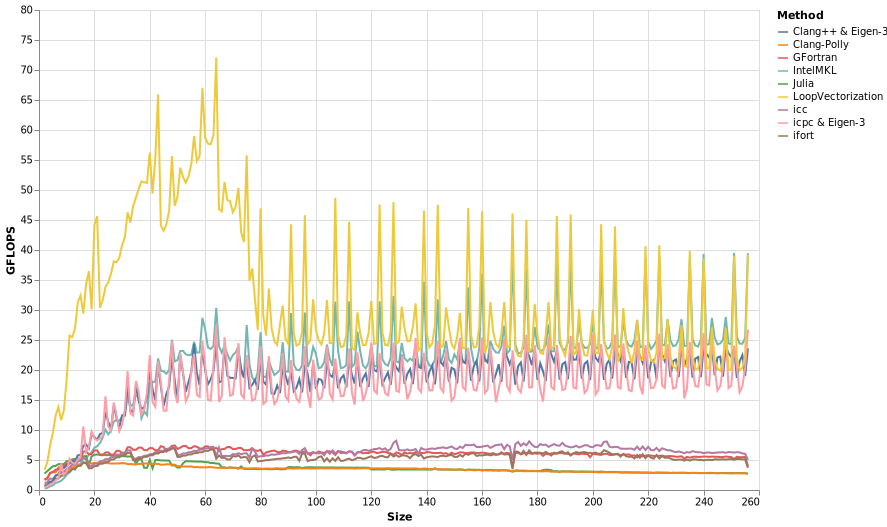

# Sum of squared error

To calculate `(y - X * β)'(y - X * β)`, we can use the following loop.
```julia
function sse_avx(y, X, β)
    lp = zero(eltype(y))
    @avx for i ∈ eachindex(y)
        δ = y[i]
        for j ∈ eachindex(β)
            δ -= X[i,j] * β[j]
        end
        lp += δ * δ
    end
    lp
end
```

LoopVectorization does not model memory access yet.
That seems important for this example, where performance starts to decline for sizes larger than 60.
Letting `N` be the size, `X` was a `3N/2`x `N/2` matrix. Therefore, performance started to suffer
when `X` had more than about 30 columns (performance is much less sensitive to the number of rows).




